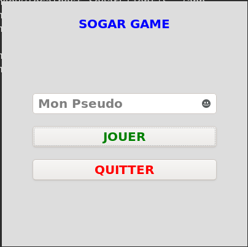

# SogarGame
## Réalisé par KAMGA DJEMGOU Hisdaele alias Kadhisk
## Jeu de concentration en C avec interface graphique à l'aide de GTK+

Nous avons deux repertoires:

1. **SogarServeur**: Il contient l'implémentation du serveur:

> - Pour compiler: **gcc  main.c  -o  serveur**
> - Pour lancer le server: **./serveur**

2. **SogarClient**: Il contient l'implémentation du client. On y trouve la réalisation de l'interface pour les joueurs et la connexion au serveur. Il faut modifier l'adresse IP du serveur dans le fichier **ConnexionTCP.h** en modifiant le macro **IP_SERVEUR** avant de compiler. On s'assure aussi d'avoir installer les librairies de **GTK+**.

> - Pour compiler: **gcc -rdynamic src/\*.c -o app $(pkg-config --cflags --libs gtk+-3.0)**
> - Pour lancer le jeu: **./prog**
> - Avant le lancer le client, il faut s'assurer d'avoir bien lançé le serveur.

Voici quelques captures d'écrans des interfaces graphiques réalisées:

